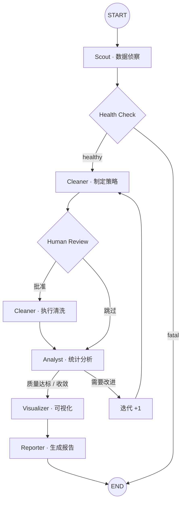

<p align="center">
  <h1 align="center">InsightFlow</h1>
  <p align="center">
    <strong>Multi-Agent 数据分析流水线</strong><br>
    基于 LangGraph 状态图编排 + MCP 协议深度集成，从原始 CSV 到分析报告的全自动协作
  </p>
  <p align="center">
    
    
    
    
    
  </p>
</p>

## 项目动机

在学习 Agent 相关技术的过程中，我发现大多数示例要么是单 Agent 的简单问答，要么是过度封装的框架演示——缺少一个"刚好够用"的多 Agent 协作案例来串联核心概念。

InsightFlow 是我为了**系统实践 LangGraph 状态图编排、MCP 协议深度特性和生产级 Agent 架构**而构建的项目。它模拟了一个真实的数据分析场景：给一份 CSV 和一句分析需求，5 个 Agent 协作完成从数据探索到报告输出的全流程。

v0.3 在初始版本基础上做了架构级重构，重点解决：全局可变状态的并发安全问题、MCP 协议的浅层使用、LLM 调用的脆弱性、错误传播的缺失、以及可观测性不足等工程化问题。

## 它做了什么

```
输入：sales_data.csv + "分析各商品类别的销售趋势"
                          ↓
   Scout → Health Check → Cleaner → Analyst → Visualizer → Reporter
                          ↓
输出：统计摘要 + 3-5 张图表 + Markdown 报告 + OTLP Trace + 质量评分 + Token 用量
```

每个 Agent 有明确的角色边界和权限范围，通过 `AgentState` 共享中间结果，由 LangGraph 控制流转顺序，并在关键节点插入健康检查和质量门控。

## 技术栈

| 层面 | 选型 | 用途 |
|------|------|------|
| 工作流编排 | LangGraph `StateGraph` | Agent 调度、条件路由、健康检查路由、循环控制 |
| 工具协议 | MCP (FastMCP) | 自建 Server 暴露 Resources / Prompts / Tools，RBAC 权限控制 |
| Agent 框架 | LangChain `create_agent` | 工具调用、Prompt 管理 |
| LLM 韧性 | 自建 ResilientLLMClient | 指数退避 + 熔断器（Closed→Open→Half-Open） |
| 数据处理 | pandas + matplotlib | 清洗、统计、图表生成 |
| 状态管理 | DataFrameContext | 会话隔离、版本快照、回滚、修改历史 |
| 可观测性 | 自建 Tracer + OTLP 导出 | `@trace_node` 装饰器 + JSON / Markdown / HTML / OTLP 四格式导出 |
| 质量评估 | 规则驱动 + 收敛检测 | 多维度 0-1 评分，质量历史收敛判断 |
| 成本控制 | TokenTracker | 逐 Agent Token 计量、模型单价估算 |
| 错误处理 | ErrorPropagator | fatal / degraded / warning 分级，决定 pipeline 继续或终止 |

## 核心架构特性

### MCP 协议深度集成

不只是把工具包一层 MCP，而是完整利用了协议的多项能力：

- **Resources（资源层）**：`resource://schema`、`resource://profile`、`resource://sample` 等 URI 可寻址数据，客户端可以直接读取而无需调用工具
- **Prompts（模板层）**：`data_analysis`、`cleaning_strategy`、`query_builder` 三个服务端 Prompt 模板，支持参数化渲染
- **RBAC 权限模型**：`PermissionChecker` 按角色（scout/cleaner/analyst/visualizer/reporter/admin）过滤可用工具，每个工具标注 `required_scope`、`risk_level`、`requires_confirmation`
- **DataFrameStore**：TTL 过期（300s）+ LRU 淘汰（上限 10）+ 访问追踪的缓存层，替代裸 dict 缓存

### 会话级 DataFrame 上下文

用 `DataFrameContext` 替代了全局 `_current_df` 变量：

- **版本快照**：每次 `apply()` 自动保存版本，支持 `rollback()` 到任意历史点
- **线程隔离**：基于 `threading.local()` 的注册表，并发 pipeline 互不干扰
- **修改审计**：`get_history()` 返回完整操作链，每一步带标签和版本号
- **向后兼容**：旧的 `set_dataframe()` / `get_dataframe()` API 仍可用，自动桥接到 Context

### 生产级 LLM 韧性

`ResilientLLMClient` 包装任意 LangChain ChatModel，提供两层保护：

- **指数退避重试**：`delay = min(base * 2^attempt + jitter, max_delay)`，自动识别瞬时错误（429、503、Timeout）
- **三态熔断器**：连续 N 次失败后进入 Open 状态快速失败，冷却后进入 Half-Open 试探性恢复

`TokenTracker` 从 LangChain 的 `usage_metadata` 提取每次调用的 prompt/completion tokens，按模型单价估算成本，线程安全，支持 `print_summary()` 一键输出用量报告。

### 结构化错误传播

`ErrorPropagator` 将 Agent 异常分类为 fatal / degraded / warning 三级：

- **fatal**（如 Scout 失败）：数据都无法加载，pipeline 直接终止
- **degraded**（如 Visualizer 失败）：降级运行，跳过可视化继续生成报告
- **warning**：记录日志，正常继续

LangGraph 图中新增 `_check_health()` 条件节点，解析 `state["errors"]` 中的 `AgentError` 对象，路由到 healthy 或 fatal 分支。

### 质量门控与收敛检测

Analyst 后的条件边不再用关键词匹配判断质量，而是调用 `eval/metrics.py` 中的 `evaluate_analysis()` 进行多维度结构化评分。新增的收敛检测机制：

- 将每轮质量分记入 `quality_history`
- 当连续两轮分数提升 < 阈值时判定收敛，避免无意义的迭代
- 质量阈值从 `state["config"]` 读取，不硬编码

### OpenTelemetry 兼容导出

`TraceSpan` 新增 `to_otlp()` 方法，将追踪数据转换为 OTLP JSON 格式（`resourceSpans` / `scopeSpans` 结构），可直接导入 Jaeger、Grafana Tempo 等平台。`export_all()` 现在同时输出 JSON、Markdown、HTML、OTLP 四种格式。

## 工作流



关键设计点：Scout 之后插入 **Health Check** 条件节点，根据 `ErrorPropagator` 的判断决定继续还是终止。Analyst 节点之后的质量门控使用结构化评分 + 收敛检测，最多迭代 2 次防止死循环。Cleaner 采用 **plan → review → execute** 三步分离，支持人工介入审批清洗策略。

## Agent 分工

| Agent | 职责 | 工具来源 | 权限范围 | 设计考量 |
|-------|------|---------|---------|---------|
| **Scout** | 加载数据，生成数据画像 | 自建 MCP Server | `data:read`, `data:query` | MCP Resources + Prompts，权限过滤 |
| **Cleaner** | 制定清洗计划 → 执行清洗 | LangChain Tools | `data:read`, `data:write` | 决策与执行分离，计划可审计 |
| **Analyst** | 统计分析，输出 findings | LangChain Tools | `data:read`, `data:query` | Context 刷新，用清洗后数据重新画像 |
| **Visualizer** | 根据分析结果选图表 | LangChain Tools | `data:read`, `output:write` | 自动匹配图表类型，支持 6 种图表 |
| **Reporter** | 汇总生成 Markdown 报告 | 无（纯 LLM 调用） | — | 单次调用，上下文来自共享状态 |

## 快速开始

### 1. 安装

```bash
git clone https://github.com/your-username/insightflow.git
cd insightflow

# 安装依赖
pip install -e ".[dev]"
# 或者使用 uv
uv sync
```

### 2. 配置

```bash
cp .env.example .env
# 编辑 .env，填入 DASHSCOPE_API_KEY
```

`.env` 中需要配置：

```
DASHSCOPE_API_KEY=sk-xxx
DASHSCOPE_BASE_URL=https://dashscope.aliyuncs.com/compatible-mode/v1
```

> 也支持其他 OpenAI 兼容接口，修改 `src/insightflow/config.py` 中的 `LLMConfig` 即可。

### 3. 运行

```bash
# 使用自带的示例数据运行
python examples/demo.py

# 指定自己的数据和分析任务
python examples/demo.py \
    --data your_data.csv \
    --task "分析用户评分与价格的关系"

# 自动模式（跳过人工审核）
python examples/demo.py --auto

# 关闭追踪 / 评估
python examples/demo.py --no-trace --no-eval
```

### 4. 测试

```bash
pytest tests/ -v
```

当前共 6 个测试文件、103 个测试用例，覆盖状态管理、工具函数、MCP Server、追踪器、评估器和 v2 全部新模块。

### 5. Web UI

```bash
# 启动 Web 服务器
python -m insightflow.server
# 或使用安装后的命令
insightflow-web
```

打开 http://localhost:8000 即可使用浏览器界面：

- **数据上传**：拖拽或点击上传 CSV 文件
- **分析任务**：输入自然语言描述分析需求
- **实时进度**：Pipeline 各阶段状态实时更新（基于 Tracer span 监控）
- **报告预览**：Markdown 格式分析报告直接渲染
- **追踪甘特图**：Agent 执行时间线可视化
- **质量评分**：各 Agent 多维度评分和等级展示
- **中间数据**：Data Profile、清洗计划、分析结果、Agent 消息日志

后端基于 FastAPI，提供 RESTful API（`/api/upload`、`/api/run`、`/api/status`、`/api/results`、`/api/download`），支持并发会话。

## 设计决策

这里记录几个我认为值得说明的设计选择和背后的思考。

**为什么用 LangGraph 而不是单个 Agent？**

最初尝试过用一个 Agent + 全部工具的方案，但很快就遇到了 prompt 膨胀和工具选择不可控的问题——10+ 个工具放在一起，Agent 经常在清洗阶段去调分析工具。拆分成多个 Agent 后，每个 Agent 的 System Prompt 更聚焦，工具集只有 3-5 个，行为变得可预测很多。条件边和循环控制也更容易表达"分析不满意就重洗"这种逻辑。

**为什么深入 MCP 协议而不只是包一层 Tool？**

MCP 的核心价值是**协议层的标准化**，但如果只用 Tool 能力，本质上跟 OpenAI Function Calling 没有区别。项目中额外利用了 Resources（URI 可寻址数据，客户端无需调用工具即可读取 schema/profile/sample）、Prompts（服务端模板，参数化渲染分析提示词）、和 RBAC 权限模型（按角色过滤工具，标注风险等级）。DataFrameStore 缓存层解决了重复加载 CSV 的性能问题，TTL + LRU 策略比裸 dict 更适合生产场景。`mcp_bridge.py` 实现了 MCP ↔ LangChain 的适配层，同时保留了一个同步降级模式方便开发调试。`safe_query` 工具做了基于正则的沙箱防护，阻止对 DataFrame 的写操作。

**为什么用 DataFrameContext 替代全局变量？**

全局 `_current_df` 在单线程场景下可以工作，但一旦涉及并发 pipeline 或需要回滚操作就会出问题。`DataFrameContext` 通过 thread-local 存储实现会话隔离，每次 `apply()` 自动保存版本快照，`rollback()` 可以退回到任意历史点。修改历史带标签记录，方便审计和调试。旧的 `set_dataframe()` / `get_dataframe()` API 仍可用，内部自动桥接到 Context，保持向后兼容。

**为什么给 LLM 客户端加重试和熔断？**

LLM API 天然不稳定——网络超时、限流（429）、服务降级都会导致调用失败。没有重试机制的 pipeline 会因为一次 API 抖动就全部失败。指数退避 + jitter 避免了重试风暴，三态熔断器（Closed→Open→Half-Open）在服务持续不可用时快速失败，冷却后自动试探恢复。这两个机制组合起来，让 pipeline 对 LLM 故障有了基本的自愈能力。

**为什么 Cleaner 要 plan + execute 分两步？**

这是 Agent 设计中"决策与执行分离"的模式。LLM 负责生成清洗计划（它擅长推理），代码负责按计划执行（它擅长确定性操作）。中间插入的人工审核节点让这个过程可干预，清洗计划本身也可以被序列化和审计。

**为什么用 ErrorPropagator 做错误分级？**

最初版本中，任何 Agent 抛异常都会导致整个 pipeline 崩溃。但实际上 Visualizer 失败不应该阻止报告生成，Scout 失败则确实没有继续的必要。`ErrorPropagator` 把错误分为 fatal（终止）、degraded（降级继续）、warning（记录继续）三级，配合 LangGraph 图中的 `_check_health()` 条件节点，让 pipeline 对不同严重程度的故障做出合理响应。

**可观测性和评估模块的设计思路？**

`@trace_node` 装饰器的设计目标是**对节点函数零侵入**——加上去不影响原有逻辑，不追踪时直接透传。追踪数据用 `TraceSpan` 数据类结构化存储，导出时支持 JSON、Markdown、HTML、OTLP 四种格式。HTML 版本是一个带暗色主题甘特图的独立页面，OTLP 格式可以直接导入 Jaeger / Grafana Tempo。TraceSpan 还新增了 `token_usage` 字段，记录每个 Agent 的 Token 消耗。

评估模块没有用 LLM 打分，而是写了 5 个规则驱动的评估函数，每个从多个维度量化评分。这样做的好处是结果可复现、不依赖额外 API 调用，也更容易理解评分依据。质量门控在 v0.3 中新增了收敛检测——连续两轮分数提升微小时自动停止迭代，避免浪费 LLM 调用。

## 项目结构

```
insightflow/
├── pyproject.toml                   # 项目配置和依赖
├── requirements.txt                 # pip 备用依赖
├── .env.example                     # 环境变量模板
├── examples/
│   ├── demo.py                      # CLI 入口
│   └── sample_data/
│       ├── sales_data.csv           # 示例电商数据 (~200 行)
│       └── README.md                # 数据集说明
├── src/insightflow/
│   ├── __init__.py                  # v0.3.0
│   ├── config.py                    # LLM 和流水线配置
│   ├── state.py                     # AgentState 共享状态 (TypedDict)
│   ├── graph.py                     # LangGraph 工作流 + 健康检查路由
│   ├── errors.py                    # AgentError + ErrorPropagator 错误分级
│   ├── agents/
│   │   ├── scout.py                 #   数据侦察 Agent（MCP 权限过滤）
│   │   ├── cleaner.py               #   数据清洗 Agent (plan + execute)
│   │   ├── analyst.py               #   统计分析 Agent（Context 刷新）
│   │   ├── visualizer.py            #   可视化 Agent
│   │   └── reporter.py              #   报告生成 Agent
│   ├── tools/
│   │   └── data_tools.py            # LangChain 工具集（Context 感知）
│   ├── mcp/
│   │   ├── data_explorer.py         # MCP Server（Resources + Prompts + DataFrameStore）
│   │   ├── mcp_bridge.py            # MCP ↔ LangChain 适配器（RBAC 过滤）
│   │   └── permissions.py           # RBAC 权限模型 + PermissionChecker
│   ├── context/
│   │   └── dataframe_context.py     # 会话级 DataFrame 上下文（版本快照 + 回滚）
│   ├── llm/
│   │   ├── resilient_client.py      # 指数退避 + 三态熔断器
│   │   └── token_tracker.py         # Token 计量 + 成本估算
│   ├── utils/
│   │   └── json_parser.py           # 统一 JSON 提取 + Schema 校验
│   ├── observability/
│   │   ├── tracer.py                # 追踪器 + @trace_node + OTLP 转换
│   │   └── export.py                # JSON / Markdown / HTML / OTLP 导出
│   ├── eval/
│   │   ├── metrics.py               # 5 个规则驱动评估函数
│   │   └── report.py                # 评估报告生成与导出
│   ├── server.py                    # FastAPI Web 服务器 (REST API + 会话管理)
│   └── static/
│       └── index.html               # 前端单页应用 (暗色主题, 5个结果标签页)
└── tests/
    ├── test_state.py                # 状态管理测试
    ├── test_tools.py                # 工具函数测试
    ├── test_mcp_server.py           # MCP Server 测试
    ├── test_tracer.py               # 追踪器测试
    ├── test_eval.py                 # 评估器测试
    └── test_v2_features.py          # v2 新模块测试 (45 cases)
```

## TODO

- [ ] 支持多数据源接入（Excel、SQLite、REST API）
- [ ] 集成 Web Search MCP，自动补充行业基准数据
- [ ] 流式输出分析进度
- [ ] 对接 LangSmith / LangFuse，将 TraceSpan 导出到第三方可观测平台
- [ ] 支持用户自定义 Agent 插入工作流
- [x] FastAPI Web UI（已完成）
- [ ] 语义级 LLM 缓存（基于 embedding 相似度复用历史响应）

## License

[MIT](LICENSE)
